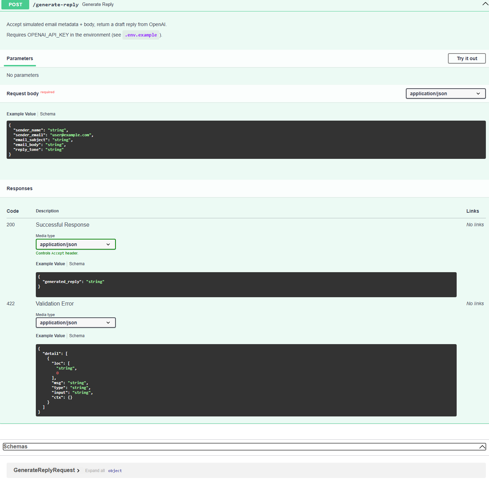

# AI Email Reply Assistant

A small **FastAPI** backend for a portfolio project aimed at **Junior AI Automation Engineer** and **AI Agent Developer** roles. The service accepts **simulated email input** (no Gmail or OAuth in this version) and returns a **draft reply** produced by the **OpenAI API** (`gpt-4o-mini`).

## What it does

- Exposes **POST `/generate-reply`**: send sender fields, subject, body, and a desired **tone**; receive **`generated_reply`** text from OpenAI.
- Uses **Pydantic** schemas for request/response validation and automatic OpenAPI (Swagger) documentation.
- Loads secrets from a **`.env`** file via **python-dotenv** (no API keys in code).

## Tech stack

| Piece | Role |
|--------|------|
| Python | Runtime |
| FastAPI | HTTP API framework |
| Uvicorn | ASGI server |
| Pydantic | Validation / serialization |
| python-dotenv | Load `OPENAI_API_KEY` from `.env` |
| OpenAI Python SDK | Chat Completions (`gpt-4o-mini`) |

## Project layout

```
.
├── README.md
├── .env.example
├── .gitignore
├── requirements.txt
└── app/
    ├── main.py                 # FastAPI app and routes
    ├── services/
    │   └── ai_service.py       # OpenAI chat completion + error handling
    └── schemas/
        └── email_schema.py     # Request/response models
```

## Configuration: create a `.env` file

This project **does not** ship a real `.env` file (and you must not commit secrets).

1. In the **project root** (same folder as `requirements.txt`), copy the example file:

   **Windows (PowerShell)**

   ```powershell
   Copy-Item .env.example .env
   ```

   **macOS / Linux**

   ```bash
   cp .env.example .env
   ```

2. Open **`.env`** in an editor and set your key:

   ```text
   OPENAI_API_KEY=sk-...your_real_key...
   ```

   The value must match the key from your [OpenAI API keys](https://platform.openai.com/api-keys) page.

3. Keep **`.env` out of git** — it is already ignored via `.gitignore`.

## Quick start: install and run

1. **Create a virtual environment** (recommended):

   ```bash
   python -m venv .venv
   ```

2. **Activate it** — on Windows (PowerShell):

   ```bash
   .\.venv\Scripts\Activate.ps1
   ```

   On macOS/Linux:

   ```bash
   source .venv/bin/activate
   ```

3. **Install dependencies**:

   ```bash
   pip install -r requirements.txt
   ```

4. **Configure `.env`** as described above so `OPENAI_API_KEY` is set.

5. **Run the server** from the project root:

   ```bash
   uvicorn app.main:app --reload
   ```

6. Open **http://127.0.0.1:8000/docs** in your browser (Swagger UI).

## Testing `POST /generate-reply` in Swagger UI

1. Start the app with `uvicorn` (see above).
2. Go to **http://127.0.0.1:8000/docs**.
3. Open the **`POST /generate-reply`** section.
4. Click **Try it out**.
5. Edit the JSON example (or use defaults), for example:

   - `sender_name`, `sender_email`, `email_subject`, `email_body`
   - `reply_tone`: e.g. `professional`, `friendly`, or `brief`

6. Click **Execute**.
7. Check the response: **`generated_reply`** should contain the model’s draft. If something fails (missing key, rate limit, network), the **HTTP status** and **detail** message explain the issue.

You can also use **curl** (adjust line breaks for your shell):

```bash
curl -X POST "http://127.0.0.1:8000/generate-reply" ^
  -H "Content-Type: application/json" ^
  -d "{\"sender_name\":\"Alex\",\"sender_email\":\"alex@example.com\",\"email_subject\":\"Project timeline\",\"email_body\":\"Can we move the deadline to Friday?\",\"reply_tone\":\"professional\"}"
```

## API

### `POST /generate-reply`

**Request body (JSON)**

| Field | Type | Description |
|--------|------|-------------|
| `sender_name` | string | Sender display name |
| `sender_email` | string | Valid email address |
| `email_subject` | string | Subject line |
| `email_body` | string | Message body (simulated) |
| `reply_tone` | string | e.g. `professional`, `friendly`, `brief` |

**Response**

| Field | Type | Description |
|--------|------|-------------|
| `generated_reply` | string | Draft reply text from OpenAI |

**Errors**

| Situation | Typical HTTP status |
|-----------|---------------------|
| Missing `OPENAI_API_KEY` | 503 |
| OpenAI rate limit / connection / API error | 502 |

## Example API Test

Below is a realistic **POST `/generate-reply`** payload you can paste into Swagger UI’s request body or send with **curl** / **Postman**. With a valid `OPENAI_API_KEY`, the server returns a single JSON object whose **`generated_reply`** field holds the full draft (wording varies each call because the model is non-deterministic).

**Example request JSON**

```json
{
  "sender_name": "John Smith",
  "sender_email": "john@example.com",
  "email_subject": "Question about your AI automation services",
  "email_body": "Hi, I am interested in your AI automation services. Can you tell me how you can help my small business save time with email replies?",
  "reply_tone": "professional"
}
```

**Example response JSON** (shape is fixed; `generated_reply` text is illustrative and truncated)

```json
{
  "generated_reply": "Dear John, thank you for your inquiry about our AI automation services..."
}
```

This example demonstrates how the backend accepts simulated email input and returns an AI-generated professional reply draft.

## Screenshot

The screenshot below shows a successful POST /generate-reply test in FastAPI Swagger UI.



## Skills Demonstrated

- Building a FastAPI backend API
- Creating a POST endpoint for AI-powered automation
- Using Pydantic models for request and response validation
- Integrating the OpenAI API with Python
- Managing API keys securely with `.env` files
- Testing APIs with Swagger UI
- Using Git and GitHub for version control
- Writing clear project documentation

## Security Notes

- The real `.env` file is ignored by Git and must never be committed.
- API keys should be stored only in local environment variables or secure deployment secrets.
- `.env.example` is included only as a safe template.

## Possible Improvements

- Connect to Gmail API or Outlook API
- Add user authentication
- Store generated replies in a database
- Add a simple frontend dashboard
- Add deployment to Render, Railway, or another cloud platform
- Add unit tests

## Project Status

Current version: working portfolio MVP with real OpenAI API integration.

## Roadmap ideas

- Streaming responses for long replies.
- Conversation history or thread id.
- Optional Gmail integration with explicit user consent.

## License

Use and modify freely for learning and portfolio use.
